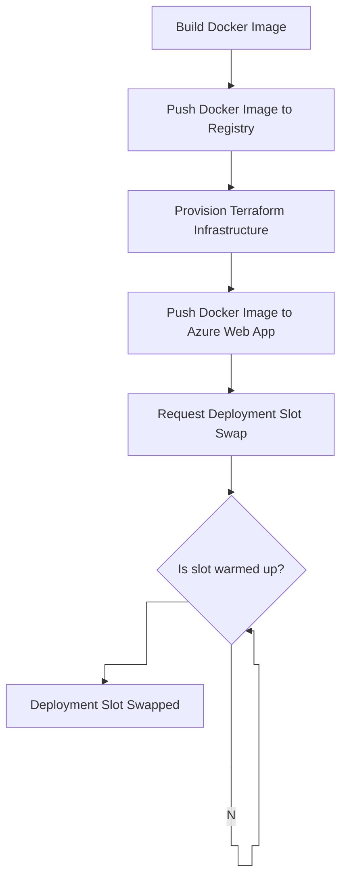
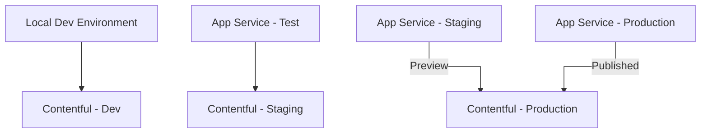
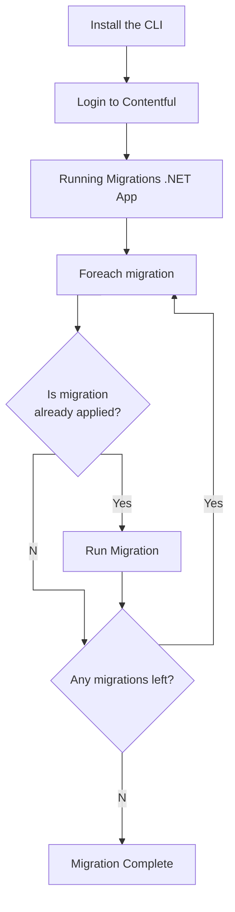

# Deployment Architecture

The build and release pipelines are all controlled via GitHub actions which act as our CI/CD process.

The actions are categorised into different types:
- **Validate**: Perform some sort of validation, such as running tests and are typically pass/fail
- **Generate**: Generate some sort of artifact, such as reporting
- **Deploy**: Perform a deployment to a target environment

## Build Pipeline

On creation of a Pull Request or push to main, multiple validation actions run, depending on what areas of the repo
have been modified. Any failures should be addressed before merging. Failures on main should be fixed as priority.

## Release Pipeline

Once the team is happy to release, they can request this via workflow dispatch. This will trigger the deployment pipeline 
and run the following steps:

## Contentful Models Deployment

Contentful Models are deployed via Contentful Migrations through the Contentful CLI. Because contentful and app service environments
are not one-to-one, the release process is managed seperately.

### App Service to Contentful Environment Mapping

### Contentful Migration Process

