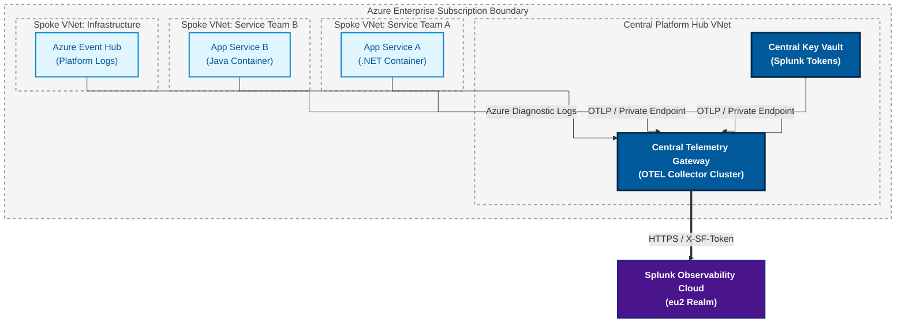

## Context and Problem Statement

The C&F portfolio currently operates a fragmented monitoring landscape characterised by disconnected tools, localised Application Insights instances, custom logging scripts, and isolated dashboarding solutions across service teams. To establish a unified monitoring platform, a recent Proof of Concept (PoC) effort validated the end-to-end ingestion of .NET application traces, metrics, and logs into Splunk Observability Cloud using localised OpenTelemetry (OTEL) Collector container sidecars deployed directly within Azure App Services.

While the PoC successfully proved that OpenTelemetry can bridge Azure workloads to Splunk, deploying and managing sidecar collector configurations on a per-application basis introduces severe operational friction and security risks when scaled across hundreds of departmental subscriptions.

To achieve a true unified enterprise monitoring platform, the department must transition from localised sidecar deployments to a centralised, managed telemetry ingestion architecture built on Azure platform capabilities.

## Decision Drivers

### Unified Platform Vision

Establishing Splunk Observability Cloud as the single pane of glass for departmental APM, infrastructure metrics, and log analytics, replacing redundant monitoring silos.

### Azure Hub-and-Spoke Governance

Aligning telemetry egress with the department's Azure Landing Zone architecture, utilising Azure Private Endpoints and ExpressRoute/VNet integration.

### Centralised Security & Secret Management

Eliminating the sprawl of Splunk Access Tokens across multiple application Key Vaults and CI/CD pipelines.

### Compliance & Data Privacy

Enforcing automated PII redaction and data masking centrally before telemetry leaves the departmental Azure security boundary.

### Operational Capacity

Preventing application development teams from absorbing the burden of maintaining, troubleshooting, and patching vendor-specific collector configurations.

## Considered Options

### Option 1 (PoC Baseline) - Decentralised Workload Sidecars

Deploying OpenTelemetry Collector sidecars within each individual App Service container, maintaining localised otel-collector-config.yaml files and managing Splunk secrets per project.

### Option 2 (Recommended Strategic Architecture) - Centralised Enterprise Telemetry Gateway Cluster

Deploying a dedicated, auto-scaling OpenTelemetry Collector gateway cluster inside a central Azure Platform Hub (using Azure Container Apps or AKS), routing all departmental telemetry through a secure private pathway to Splunk Observability Cloud.

## Critical Evaluation of Option 1 (PoC Baseline)

While effective for initial feature validation, embedding OTEL Collectors into individual application workloads introduces critical enterprise deficiencies:

### Fragmented Management & Drift

Managing hundreds of isolated collector YAML configs across multiple service teams leads to version drift, inconsistent pipeline rules, and high maintenance overhead.

### Credential & Secret Sprawl

Injecting X-SF-Token or Splunk HEC tokens into every application Key Vault increases the attack surface and makes token rotation functionally impossible without risking application downtime.

### Uncontrolled Data Costs

Lacking a centralised ingestion buffer, malfunctioning applications can flood Splunk Cloud with unthrottled logs or high-cardinality metrics, risking unbudgeted cost overruns.

### Incomplete Observability Scope

Sidecars only solve application-level telemetry; they fail to capture platform-level Azure diagnostic logs, VNet flow logs, and Key Vault audit trails required for holistic operations.

### Inefficient Security Boundaries

Requiring every application spoke VNet to maintain direct egress to Splunk endpoints creates unnecessary external exposure across the Azure estate.

## Strategic Decision (Option 2)

We propose rejecting application-bound sidecar collectors as a production standard, moving instead to establish a centralised Enterprise Telemetry Gateway hosted in an Azure Management Hub.

## Strategic Architecture Standards

### Decoupled Application Layer

Application workloads (Azure App Services, Function Apps) emit native OpenTelemetry protocols (OTLP) directly to an internal, load-balanced Azure Private Endpoint. Applications carry zero vendor configurations or Splunk credentials.

### Centralised Hub Architecture

A high-availability OpenTelemetry Gateway cluster deployed in the central Azure Platform Hub receives all internal telemetry via private networking.

### Single Point of Governance

The central gateway assumes full responsibility for:

* Injecting X-SF-Token credentials stored in a single, centrally audited Azure Key Vault.

* Transforming and routing signals to explicit Splunk endpoints (/v2/trace/otlp, /v2/datapoint/otlp, and HEC /services/collector/event).

* Enforcing mandatory PII masking, log filtering, and metric sampling prior to egress.

### Unified Azure Diagnostic Pipeline

Azure platform diagnostic settings (App Service logs, Key Vault audits, Activity logs) route to an Azure Event Hub, which feeds directly into the Central Gateway for unified transmission into Splunk Observability Cloud.

## Consequences

### Positive

#### True Single Pane of Glass

Integrates application traces, .NET runtime metrics, and Azure infrastructure logs into Splunk Observability Cloud under a single unified topology.

#### Zero Secret Exposure to Service Teams

Project teams require no knowledge of Splunk tokens or ingest endpoints; credentials remain isolated within the platform hub.

#### Guaranteed Enterprise Compliance

Data scrubbing and PII masking rules are enforced universally at the gateway, preventing accidental policy violations.

#### Operational Efficiency

Collector maintenance, vendor endpoint updates, and buffer tuning are handled by the core platform team once, rather than N times across project teams.

### Negative & Risks

#### Central Infrastructure Ownership

Requires dedicated platform engineering bandwidth to provision, monitor, and scale the central Azure Container Apps/AKS gateway cluster.

#### Dependency on Central Egress

High-availability provisioning (multi-AZ deployment and horizontal pod autoscaling) is required to ensure the gateway never becomes a performance bottleneck for downstream applications.
